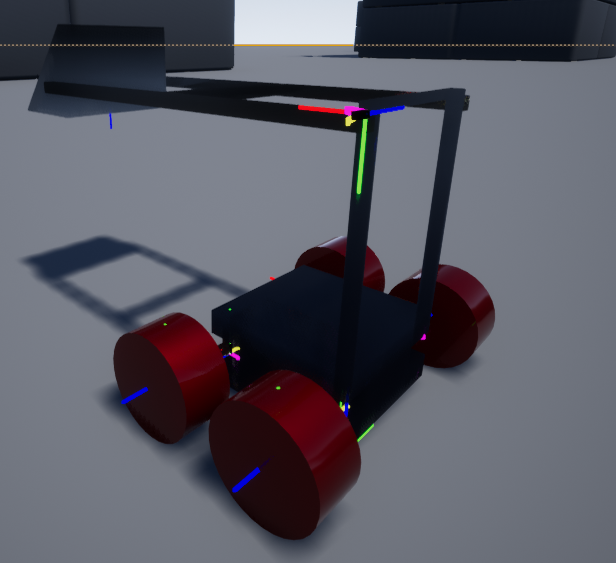

# Using Debug Mode for URDF bots. 

## Overview
Construction of a URDF file can be difficult. In order to make this process easier, the system supports a debug mode. This mode draws the reference frame axes for each of the links specified in the URDF file, as well as the joint relationships between the links. To enable debug mode, set the DebugSymbolScale to a value greater than zero, as specified in [AirSim Settings for URDF simulation](UrdfSettings.md). Increasing this value will increase the size of the debug symbols drawn to the screen. 

## Symbols
When debug mode is enabled, the following symbols will be drawn:

* **Coordinate axes**: For each link, three lines will be drawn from the origin of the link's reference frame. A red line will be drawn in the +X direction, a green line in the +Y direction, and a blue line in the +Z direction.
* **Joint constraints**: Depending on the joint type, a different symbol will be drawn:
    * **Fixed**: For fixed joints, a dark green point will be drawn at the location of the joint. 
    * **Floating**: For floating joints, a dark green sphere will be drawn at the location of the joint.
    * **Revolute**: A black line will be drawn around the axis of revolution, a yellow line will be drawn at the point of minimal rotation (that is, at location=lower), and a magenta line at the point of maximal rotation (that is, at location=upper)
    * **Continuous**: A magenta circle will be drawn perpendicular to the axis of rotation.
    * **Prismatic**: A dark green line will be drawn along the axis of motion. A yellow point will be drawn at the point of minimal extension (that is, location=lower), and a magenta point will be drawn at the point of maximal extension (that is, location=upper).
    * **Planar**: A thin dark green box will be drawn along the axes of motion. Note that although a box is used to specify the extent limits, the constraint is actually circular. 
    
Here's an example of the lunabot in debug mode:

