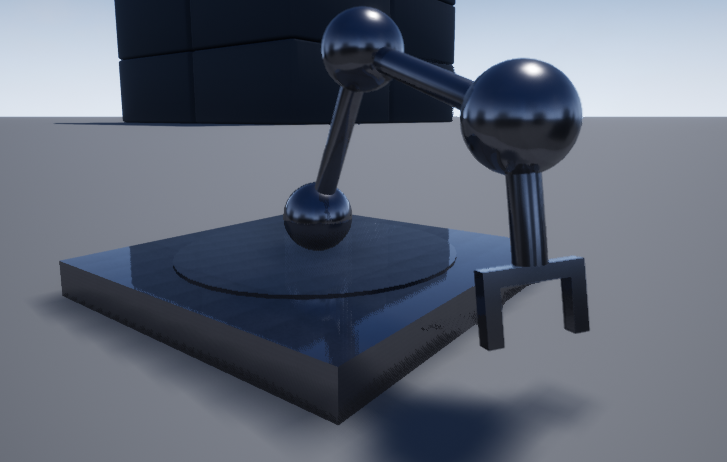

# Using a URDF Pawn

## Overview

There are three things that need to be created in order to simulate your robot:

* A URDF XML file. This file specifies the geometry and kinematic model of the robot. For more details about constructing this file, see [Construct a URDF XML](UrdfXml.md).
* The settings.json file. This file specifies which URDF XML file is used for the bot, the camera views that are available, and the sensors that are attached to the bot. For more details, see [Airsim Settings for URDF Simulation](UrdfSettings.md).
* A python or c++ client. This client uses the corresponding API to send control signals from the user's code to the simulator. For more details, see [Constructing the python client](UrdfClient.md).

For complete examples, look in the folder Examples/UrdfBot. This has two complete examples. The first example is the Lunabot, which is a skid steer robot designed for a mining application. 

This example can be run by using the settings-lunabot.json file, the LunabotFromMesh.xml file, and the LunabotClientTest.py python script in PythonClient/urdfbot. Before using this example, please examine the LunabotFromMesh.xml file and settings-lunabot.json to ensure that the absolute file paths pointing to the meshes match the location on disk.

The second example is a 4 DOF robotic arm. This shows how one can create a robot without using external meshes by combining simple shapes.

Thie example can be run by using the settings-arm.json file, the RobotArm.xml file, and the ArmClientTest.py python script in PythonClient/urdfbot. Before using this example, please examine the settings-arm.json file and ensure that the absolute file path for the xml file points to the RobotArm.xml file's location on disk. 
